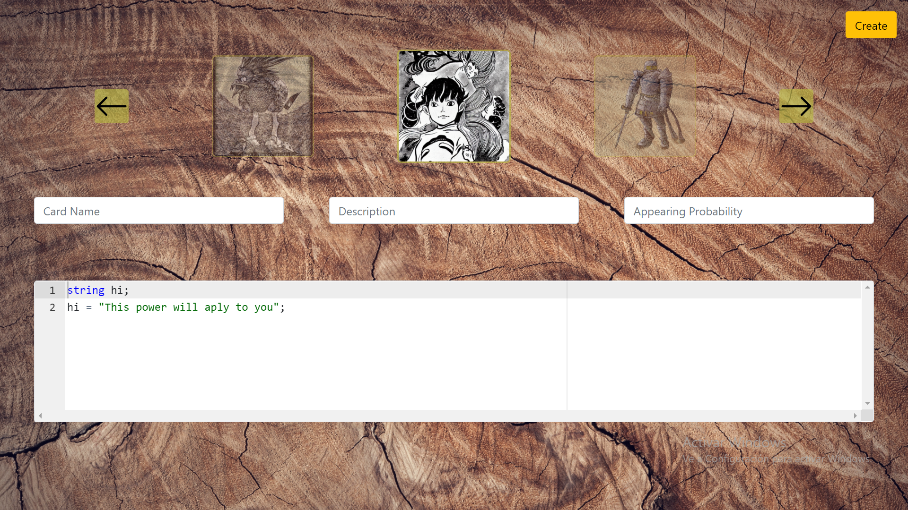

# *Card-Attack!*

Card-Attack! is a trading card game inspired in the popular franchises *"Pokémon"* and *"Yu-Gi-Oh"*. It is played by turns between two players that uses their cards to figh their enemy until one of them is defeated.

## Game Rules

Each player can put as many cards as they desires, but always keeping a maximum of **5** in the table. The cards can be invoked by double-clicking them, and only *Monster cards* (in brown color) can be placed in the table. Then the *Effect cards* can be equiped to the player's *Monster cards* by clicking first the card and then the monster that will be equiped with this power.

Single click in a card on your field will select it and display useful information in the right panel, like the attack, hp, powers and description of the card. Another click will un-select it and the displayed info will be hidden.

To attack straight to an enemy's card, first, click a card from your side of the table that will attack, then click in a card of your enemy and the attack will be completed.

To use a power, first, click a card on your side of the table, then in the right panel click on the power you wanna use, finally, click in a card from your enemy's table and the power will be used.

To end a turn just press *space* bar. To return to the main menu, press *esc*.

The game end when a player has no monsters left, in that case, the other player will win and the **Game Over** screen will be displayed with the name of the winner (*Player A* or *Player B*).

## Install and execution steps

### Prerequisites

1. A working installation of [**DotNet Core 6.0**](https://dotnet.microsoft.com/en-us/download/dotnet/6.0).
2. An updated web browser. With **Google Chrome v97.0.4692.71** or higher should be fine. **Disclaimer:** in some outdated browsers or even **Microsoft's Internet Explorer/Edge** some features may **NOT** work.
3. A console or terminal emulator like **powershell** or **konsole**

### Installing steps

1. Clone this repository on your computer
2. `cd` to the main folder of the project
3. Run the command:

    dotnet run --project CardWEB

4. Open in your browser one of the links displayed after the command runs

## How to's

### How to create a new card?

From the main menu, click in the **New Card** button. Then select the type of card you want to crate.

If you select **Monster Card** will be displayed something like this:

Then just fill the formulary, select an image by clicking the arrows and click on the **Create** button.

If you select **Effect Card** will be displayed something like this:

The process is pretty similar to the one above. The only difference is that you **must** code an hability using the *MLC* language. For more info about it click [here](SYNTAX.md).

### How to select my deck?

From the main menu click in the **Select Deck** button.

Then click the cards you want in your deck (only can have one of each type for avoid cheating :3). If accidentally you click a card you don't want, just click-it back and it will disappear from your deck.

This data will be stored locally and not in the server, so if the history is deleted then you may loose your deck.

Finally, if you select more cards than the game allows, some of them will be taken randomly. In the other hand, if you select less cards than the limit, the game will automatically complete this gap with random cards.
